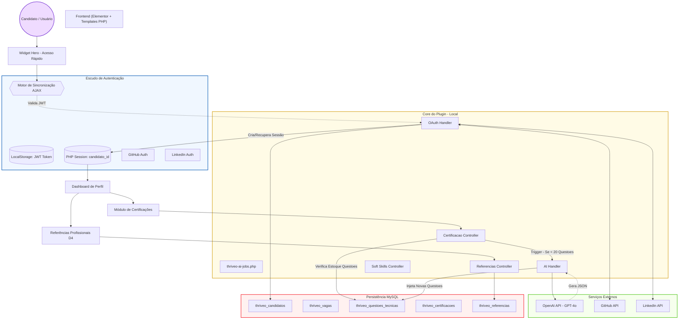

# 🏗️ Arquitetura Geral do Sistema Thriveo AI Jobs

Este diagrama ilustra a integração entre os componentes do sistema, desde a autenticação do usuário até o processamento de IA e persistência de dados.

### 🗝️ Componentes Chave:

1.  **Actor (User):** Especialista em IA que consome os serviços.
2.  **Auth Layer:** O ponto central de segurança. O **Sync Motor** é a inovação que evita o logoff quando a sessão PHP expira, usando o **JWT** como âncora de identidade.
3.  **Core del Plugin:** Controladores PHP que processam a lógica de negócio separada da visualização.
4.  **AI Handler:** Ponte inteligente com a **OpenAI (GPT-4o)** para automação de testes técnicos.
5.  **DB Schema:** Tabelas customizadas no WordPress para gestão de talentos e validações.

---
**Diagrama gerado em 10 de Março de 2026.**
